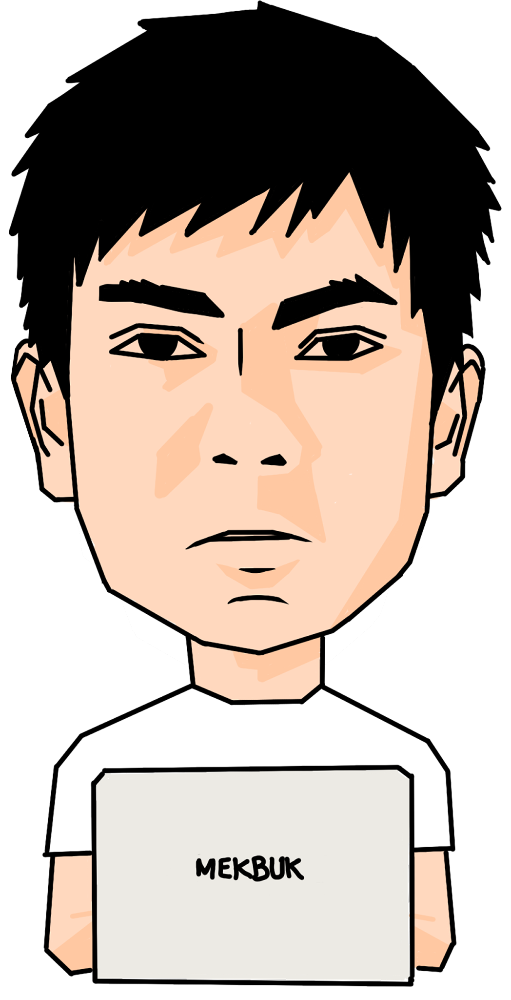

<!-- Define heading -->
<h1>Helloooooo World! </h1>

<!-- Define content -->

<b>Hey there,</b>

<ul>
    <li> My name is A. Muh. Mufqi Zuhudi.</li>
    <li> Currently, I live in Makassar, Indonesia.</li>
    <li> I love learning new technologies, particularly interested in information theory, quantum, networking, AI, cloud, and DevOps.</li>
    <li> I'm currently focusing on learning data science, cloud, and DevOps.</li>
    <li> If you have any project related to my interest, I'll be happy to collaborate.</li>
</ul>

 Please reach me at <a href="mailto:moefqy@rocketmail.com">moefqy@rocketmail.com</a>.

    
    
    
    
    

<!-- Define footer -->

<i> Last Edited on: 30/04/2024 </i>
